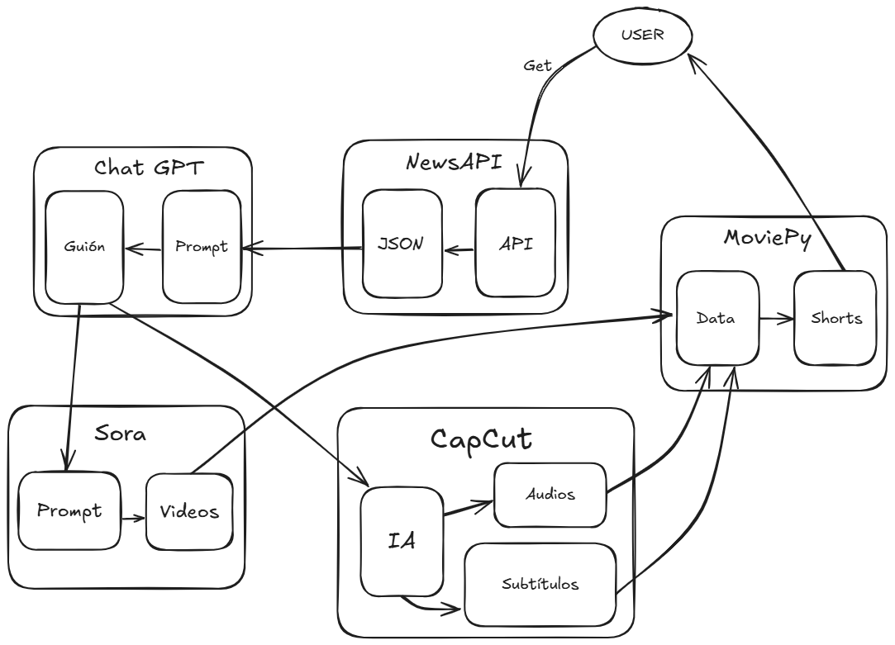

# 🎬 Automatizador de Shorts de YouTube con noticias

Este proyecto genera vídeos tipo **Short de YouTube** de forma automatizada, combinando clips de vídeo, audios y subtítulos. Además, recopila noticias actuales desde **NewsAPI** para crear contenido diario basado en temas tecnológicos, económicos, salud, ciencia, deportes y políticos.

Es un proyecto personal enfocado a la automatización y producción masiva de contenido audiovisual mediante código Python.


## 🚀 Tecnologías utilizadas

- Python 3.10 o 3.11
- MoviePy (edición de vídeo y audio)
- PySRT (lectura de subtítulos `.srt`)
- Requests (peticiones HTTP)
- dotenv (manejo de variables de entorno)
- ffmpeg (externo, requerido por MoviePy)
- ImageMagick (externo, requerido para subtítulos)


## 📦 Instalación

1. Clona el repositorio:
```bash
git clone https://github.com/davidrguez98/ytshorts-generator
```

2. Accede al proyecto y crea un entorno virtual (opcional pero recomendado):
```bash
cd ytshorts-generator
python -m venv venv
source venv/bin/activate  # o .\venv\Scripts\activate en Windows
```

3. Instala las dependencias:
```bash
pip install -r requirements.txt
```

4. Asegúrate de tener instalado:
   - [ffmpeg](https://ffmpeg.org/download.html)
   - [ImageMagick](https://imagemagick.org/script/download.php)  
     > *Durante la instalación, marca la casilla "Install legacy utilities"*

5. Crea un archivo `.env` en la raíz con tu clave de NewsAPI:
```
APIKEY_NEWS=tu_clave_aqui
```


## 📁 Estructura del proyecto

```bash
├── data
│   ├── audio
│   ├── subtitles
│   └── vid
├── prompts
│   ├── chatgpt.txt
│   └── sora.txt
├── src
│   ├── main.py
│   ├── new1.py
│   ├── new2.py
│   ├── new3.py
│   ├── newsAPI.py
│   └── top3.py
├── videos/                  # Carpeta de salida para los Shorts generados
├── .env                     # Clave API de NewsAPI
├── requirements.txt
└── README.md
```


## 🧠 Funcionamiento

- **newsAPI.py** conecta a la API y genera el archivo `data_news.json` con las noticias del día.
- **data_news.json** se copia en ChatGPT junto con el prompt `chatgpt.txt` para generar un guion.
- **ChatGPT, Sora y CapCut**:
  - **ChatGPT** genera el guion del vídeo.
  - **Sora** genera los clips (usando el prompt `sora.txt`). Se generan **2 vídeos verticales (formato 9:16)** de aproximadamente **10 segundos cada uno**.
  - **CapCut** puede usarse para ajustar visualmente si se desea.
- **new1.py, new2.py, new3.py** ensamblan los vídeos Shorts combinando clips, audio y subtítulos.
- **top3.py** crea un vídeo resumen con los 3 mejores clips.
- **main.py** ejecuta todos los scripts automáticamente. Puedes comentar o descomentar según los vídeos que quieras generar.


## 🎯 Objetivos del proyecto

- Automatizar la generación de contenido en vídeo basado en noticias.
- Practicar el uso avanzado de MoviePy.
- Aprender integración de APIs externas (NewsAPI).
- Sentar la base para escalar a miles de vídeos mensuales.


## 📚 Aprendizajes

- Manipulación avanzada de vídeo y audio en Python.
- Subtitulación dinámica con `.srt`.
- Uso de `.env` para claves API.
- Organización modular de scripts para automatización.


## 📌 Notas

- El sistema no incluye autenticación ni subida directa a YouTube (aunque puede integrarse con la API).
- Ideal para escalar hacia producción masiva de contenido informativo o viral.

## 🗺️ Excalidraw



## 👨‍💻 Contacto

Si quieres ver más proyectos o ponerte en contacto conmigo:

- GitHub: [@davidrguez98](https://github.com/davidrguez98)
- LinkedIn: [David Rodríguez](https://www.linkedin.com/in/davidrguez98)
- Correo: ropeda98@gmail.com

¡Estoy abierto a colaboraciones, feedback o nuevas oportunidades!
